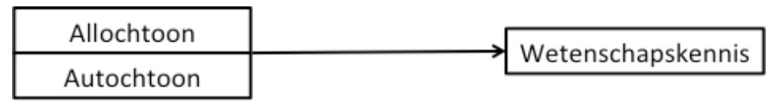
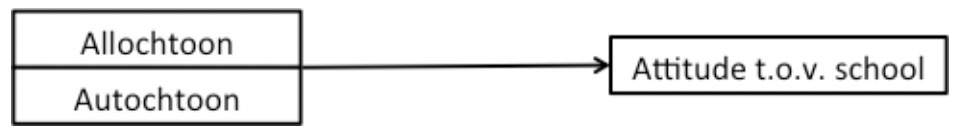

```{r setup, include=FALSE}
knitr::opts_chunk$set(echo = TRUE)
load("Data ZSO2.RData")
source("~/Documents/Onderwijs/STAT B/2020-2021/ZSOs/OLP2 Functies.R")
```

# OPDRACHTEN {-}

## Vraag 1 {-}

Als minister van onderwijs enerzijds en van gelijke kansen anderzijds heeft Ella twee belangrijke speerpunten in haar beleid: wetenschapsonderwijs en ‘met goesting naar school gaan’. Op het kruispunt tussen haar twee beleidsdomeinen schrijft zij een onderzoeksopdracht uit: “Een stand van zaken inzake gelijke kansen met betrekking tot wetenschapskennis en schoolattitude. Is het allochtoon deficit anno 2020 weggewerkt?”.

Jij dient als jonge onderzoeker, samen met de promotor van je thesis, hiervoor een projectvoorstel in. Jullie beloven om met behulp van de representatieve steekproef van PISA in kaart te brengen of en hoe groot de verschillen zijn tussen allochtone en autochtone 14-jarige leerlingen in wetenschapskennis en attitude ten aanzien van de school. Hierbij gaan jullie ook na op welk van beide twee elementen allochtone afkomst meer van invloed is.

‘Pisa2’ is een file met daarin voor alle Vlaamse leerlingen uit de PISA-bevraging 2018 hun etnische afkomst (‘Immigratie’), sociaal-economische status (‘SESz’), hun score op een wiskunde- (‘Wiskundez’), taal- (‘Lezenz’) en wetenschapstest (‘Wetenschappenz’), de attitude van leerlingen ten aanzien van de school (‘Attitudeschoolz’) en ten aanzien van computers (‘Attitudecomputersz’) en enkele scores op leerschalen (‘Samenvattenz’, ‘Begrijpenz’, ‘Memoriserenz’).

*Formuleer de onderzoeksvragen en hypotheses. Kies de gepaste analysetechniek.*

[RESPONS ACHTERAAN DOCUMENT]

## Vraag 2 {-}

Nu we een keuze gemaakt hebben voor de analysetechnieken zijn we klaar om onze handen vuil te maken en empirisch op zoek te gaan naar antwoorden op deze onderzoeksvragen.

*Voer de gepaste analyses uit om de onderzoeksvragen te beantwoorden. Geef de	relevante output van je analyses en bespreek deze. Stel het resultaat ook visueel voor.*

[RESPONS ACHTERAAN DOCUMENT]
\newpage

# RESPONSEN {-}

## Vraag 1 {-}

Een **eerste onderzoeksvraag** die we uit het geschetste onderzoeksprobleem kunnen afleiden zou als volgt geformuleerd kunnen worden:

> OV1:	In welke mate heeft etnische afkomst een invloed op de wetenschapskennis van leerlingen?

Visueel ziet dit er als volgt uit:

```{r, out.width = "250px", echo=F}

```

*Hypotheses:*

> Nulhypothese (H0): Er is in de populatie geen verschil in wetenschapskennis tussen leerlingen van allochtone en van autochtone afkomst.
 
> Alternatieve hypothese (H1):	Er is in de populatie wel een verschil in wetenschapskennis naar etnische afkomst.

*Analysetechniek:* t-test

\bigskip

**Onderzoeksvraag 2** die we uit het geschetste onderzoeksprobleem kunnen afleiden kan als volgt luiden:

> OV2:	In welke mate beïnvloedt etnische afkomst de positieve attitude van leerlingen t.a.v. de school?

Visueel ziet dit er als volgt uit:

```{r, out.width = "250px", echo=F}

```

*Hypotheses:*

> Nulhypothese (H0): Er is in de populatie geen verschil in attitude ten aanzien van de school tussen allochtone en autochtone leerlingen.
 
> Alternatieve hypothese (H1):	Er is in de populatie wel een verschil in schoolattitude naar immigratie status.

*Analysetechniek:* t-test

\bigskip

**Onderzoeksvraag 3** kan als volgt geformuleerd worden:

> OV3:	Is de invloed van etnische afkomst op wetenschapskennis sterker dan op schoolattitude? 

*Analysetechniek:* Deze onderzoeksvraag kan je beantwoorden a.d.h.v. de resultaten van de analyses van OV1 en OV2. Je vergelijkt daartoe de Cohen’s d’s.

## Vraag 2 {-}

**OV1**

a) Hercoderen ‘Immigratie’

In het Pisa2 databestand vinden we de variabele ‘Immigratie’ terug. Deze heeft echter drie categorieën. Dit kunnen we zien door een tabel op te vragen met absolute frequenties:

```{r}
table(Pisa2$Immigratie)
```

Gezien we enkel geïnteresseerd zijn in het onderscheid tussen autochtone en allochtone leerlingen moeten we deze variabele eerst hercoderen. We voegen daarbij de categorieën ‘Second-generation’ en ‘First-generation’ samen tot ‘Allochtoon’. Daartoe maken we gebruik van het commando `recode` uit het pakket  `car`. Ter controle vragen we ook een tabel met absolute frequenties op voor de nieuw gemaakte variabele.

```{r, tidy="tidy", comment=""}
library(car)
Pisa2$Allochtoon<-recode(Pisa2$Immigratie,
                         "'Native'='Autochtoon';
                         'Second-Generation'='Allochtoon';
                         'First-Generation' ='Allochtoon'")
table(Pisa2$Allochtoon) 
```

b) De feitelijke analyses (t-testen)

Bij de eerste onderzoeksvraag is de afhankelijke variabele `Wetenschappenz`. 

We starten met een eerste beschrijvende verkenning van de gegevens door per categorie van de variabele `Allochtoon` zowel het gemiddelde als de standaardafwijking voor `Wetenschappenz` te berekenen:

```{r, comment=""}
#  Gemiddelde
tapply(Pisa2$Wetenschappenz, Pisa2$Allochtoon, mean, na.rm=TRUE)
```


```{r, comment=""}
# Standaardafwijking
tapply(Pisa2$Wetenschappenz, Pisa2$Allochtoon, sd, na.rm=TRUE)
```

Vooraleer we een t-test kunnen uitvoeren gaan we na of de assumptie van gelijke binnengroepvarianties opgaat. Daarbij onderzoeken we of de variantie in wetenschapskennis tussen autochtone leerlingen onderling niet significant afwijkt van de variantie in wetenschapskennis tussen allochtone leerlingen onderling. Daartoe voeren we de Levene Test uit:

```{r, comment=""}
leveneTest(Pisa2$Wetenschappenz, Pisa2$Allochtoon)
```

De p-waarde van deze test toont aan dat er geen significant verschil is in varianties tussen beide groepen (*F*(1,4522) = 2.26; *p* = 0.133). Dit impliceert dat we kunnen uitgaan van gelijke varianties bij het uitvoeren van de t-test.

```{r, comment=""}
t.test(Pisa2$Wetenschappenz~Pisa2$Allochtoon, var.equal=TRUE)
```

We willen ons ook kunnen uitspreken over hoe sterk het verschil is. Daartoe berekenen we de Cohen's d. Dit doen we door gebruik te maken van de functie `d()` opgenomen in `OLP2 functies`.

```{r, comment=""}
# source(file.choose()) # OLP2 functies laden, hier even niet uitgevoerd
d(Pisa2$Wetenschappenz,Pisa2$Allochtoon)
```
\newpage

c) Bespreking van de resultaten met verwijzing naar de output

Uit de resultaten van de Levene’s test blijkt dat de binnenen-groepen-variantie voor beide groepen (allochtoon en autochtoon) niet significant afwijkt van 0 (*F*(1,4522) = 2.261, *p* = 0.133). De kans dat het verschil in binnen-groepen-variantie tussen beide groepen 0 is, bedraagt 0.133. We kunnen de nulhypothese in dit geval niet verwerpen en gaan ervan uit dat de binnengroepvariantie voor beide groepen gelijk is.
In de PISA-steekproef scoren kinderen van autochtone afkomst (*M* = 0.095, *SD* = 0.954) gemiddeld gezien hoger op de wetenschapstoets dan kinderen van allochtone afkomst (M = -0.751, SD = 1.011). We verwachten dit verschil ook in de populatie terug te vinden (*t*(4522) = -17.155, *p* < 0.001). We verwerpen dus de nulhypothese ten voordele van de alternatieve hypothese: er is in de populatie wel een verschil in wetenschapskennis naar etnische afkomst. We verwachten dat kinderen van allochtone afkomst tussen 0.749 en 0.943 standaardafwijkingen lager scoren op de wetenschapstoets dan kinderen van autochtone afkomst. (Dit verschil wordt hier aangegeven in standaardafwijkingen omdat ‘Wetenschappenz’ een z-score is.) We kunnen dit effect van etnische origine op wetenschapskennis omschrijven als een groot effect (*d* = 0.861).

d) Visualisatie van de resultaten

```{r, comment="", fig.align = "center"}
errorbar(Pisa2$Wetenschappenz~Pisa2$Allochtoon)
```

`R` geeft hier een aantal warnings en toont het interval ook niet voor de autochtone leerlingen. Eigenlijk is het betrouwbaarheidsinterval, mede door de grote steekproef, te klein om te kunnen tekenen.
\bigskip

**OV2**

a) Analyses

```{r, comment="", tidy="tidy"}
leveneTest(Pisa2$Attitudeschoolz, Pisa2$Allochtoon)
tapply(Pisa2$Attitudeschoolz, Pisa2$Allochtoon, mean, na.rm=TRUE)
tapply(Pisa2$Attitudeschoolz, Pisa2$Allochtoon, sd,   na.rm=TRUE)

t.test(Pisa2$Attitudeschoolz ~ Pisa2$Allochtoon, var.equal=FALSE)
d(Pisa2$Attitudeschoolz,Pisa2$Allochtoon)
```
\newpage
b) Resultaten bespreken met verwijzing naar output

Uit de resultaten van de Levene’s test blijkt dat de binnen-groepen-variantie voor beide groepen (allochtoon en autochtoon) significant afwijkt van 0 (*F*(1,4130) = 8.299, *p* <0.004). De kans dat het verschil in binnen-groepen-variantie tussen beide groepen 0 bedraagt is kleiner dan 5%. We verwerpen de nulhypothese in dit geval wel en gaan ervan uit dat de binnen-groepen-variantie voor beide groepen ongelijk is.
In 2009 was voor de Vlaamse kinderen die meededen aan het PISA-onderzoek de attitude ten aanzien van de school verschillend naar etnische origine. Kinderen van allochtone afkomst hadden gemiddeld gezien een meer positieve houding ten aanzien van de school (*M* = 0.120, *SD* = 1.091) dan kinderen van autochtone origine (*M* = -0.009, *S*D = 0.986). Een independent samples t-test geeft aan dat we deze bevindingen kunnen generaliseren naar de populatie: in de populatie hebben kinderen van allochtone origine een meer positieve attitude ten aanzien van de school (*t*(429.09) = 2.18, *p* = 0.030). We hebben slechts 3% kans dat we ons vergissen in deze uitspraak. Wanneer we echter kijken naar de grootte van dit effect, merken we dat dit verwaarloosbaar klein is (*d* = 0.124). We concluderen dus dat er in de populatie van 14-jarige Vlaamse leerlingen geen verschillen zijn in attitude ten aanzien van de school naar etnische origine van de leerling.

c) Visualisatie van de resultaten

```{r, comment=""}
errorbar(Pisa2$Attitudeschoolz~Pisa2$Allochtoon)
```

**OV3**

De invloed van etnische afkomst op wetenschapskennis (*d* = 0.861) is groter dan deze op attitude ten aanzien van de school (*d* = 0.124). We kunnen deze effecten respectievelijk groot en verwaarloosbaar klein noemen.